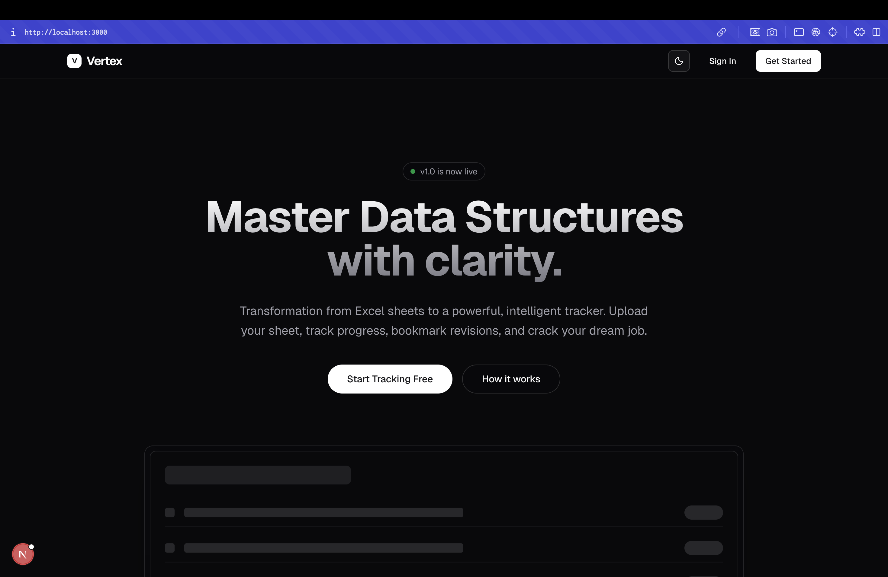
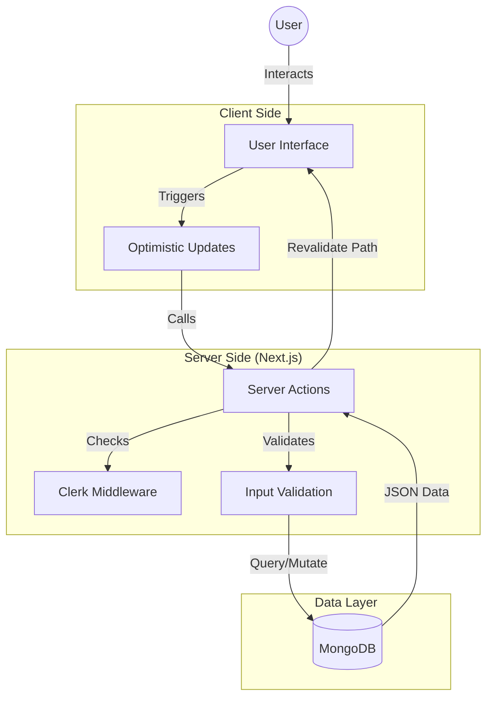
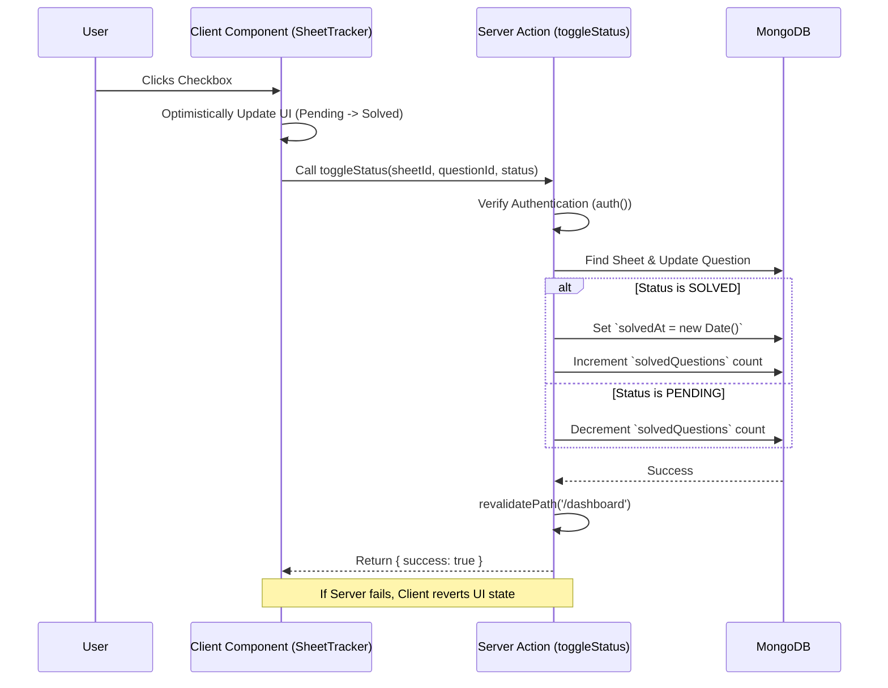

# Vertex 🚀

> **A Premium, User-Centric DSA Progress Tracker.**

Vertex is a comprehensive Data Structures and Algorithms (DSA) sheet tracker designed to help developers organize, track, and visualize their preparation journey. Built with a focus on aesthetics, user experience, and robust data management, Vertex transforms the chaotic process of solving LeetCode/GFG problems into a streamlined, gamified workflow.

 <!-- Replace with actual screenshot if available -->

---

## ✨ Features

### 📊 Comprehensive Tracking
*   **Sheet Management**: Import any standard DSA sheet (Striver's SDE Sheet, Love Babbar 450, etc.) via Excel/JSON or create your own.
*   **Question Status**: Mark problems as `Pending` or `Solved`.
*   **Revision Bookmarks**: Star ⭐ important problems for last-minute revision.
*   **Notes**: Add markdown-supported notes to any problem to document your approach and time complexity.

### 📈 Analytics & Visualization
*   **Activity Heatmap**: A GitHub-style contribution graph that visualizes your daily consistency.
*   **Overall Progress**: Circular and linear progress indicators showing your aggregate completion rate across all sheets.
*   **Sheet-level Stats**: Individual progress bars and completion percentages for each imported sheet.

### 🛠️ Powerful Management
*   **CRUD Operations**: Add, Edit, Delete questions directly within the UI.
*   **Reordering**: Insert new questions at specific positions (e.g., "Insert Problem Below").
*   **Sheet Actions**: Rename or delete entire sheets with ease.
*   **Smart Tables**: "Topic-only" rows are automatically detected and styled as section headers for better readability.

### 🎨 Premium UI/UX
*   **Modern Design**: Built with Shadcn UI and Tailwind CSS for a sleek, glassmorphic aesthetic.
*   **Dark Mode**: Fully supported system-aware dark mode.
*   **Mobile Responsive**: Optimized layout for seamless use on phones and tablets.
*   **Optimistic UI**: Instant feedback on all actions (toggles, bookmarks, edits) for a snappy experience.

---

## 🏗️ Technology Stack

Vertex is built on a modern, type-safe stack ensuring performance, scalability, and developer experience.

| Category | Technology | Usage |
| :--- | :--- | :--- |
| **Framework** | [Next.js 14](https://nextjs.org/) | App Router, Server Components, Server Actions |
| **Language** | [TypeScript](https://www.typescriptlang.org/) | Static typing for reliability |
| **Styling** | [Tailwind CSS](https://tailwindcss.com/) | Utility-first styling |
| **UI Library** | [Shadcn UI](https://ui.shadcn.com/) | Reusable, accessible components (based on Radix UI) |
| **Icons** | [Lucide React](https://lucide.dev/) | Consistent & clean SVG icons |
| **Authentication** | [Clerk](https://clerk.com/) | Secure user authentication & session management |
| **Database** | [MongoDB](https://www.mongodb.com/) | NoSQL document storage |
| **ORM** | [Mongoose](https://mongoosejs.com/) | Type-safe database modeling |
| **Utilities** | `date-fns`, `clsx`, `sonner` | Date formatting, class merging, toast notifications |

---

## 📐 Architecture

Vertex follows a **Server-First** architecture leveraging Next.js App Router capabilities.



### Key Architectural Decisions
1.  **Server Actions**: All mutations (add, update, delete, toggle) are handled via Server Actions (`app/actions.ts`), eliminating the need for a separate API layer.
2.  **Optimistic UI**: Key interactions like marking a question as solved or bookmarking are updated instantly in the UI state while the server request processes in the background.
3.  **Atomic Design**: Components are modularized (`SheetCard`, `SheetTracker`, `ActivityHeatmap`) for reusability and isolation.

---

## 🔄 Data Flow

### 1. User Toggles "Solved" Status
The following sequence describes how data flows when a user interacts with the tracker.



---

## 🚀 Getting Started

### Prerequisites
*   Node.js 18+
*   MongoDB Atlas URI
*   Clerk API Keys

### Installation

1.  **Clone the repository**
    ```bash
    git clone https://github.com/somilgupta/vertex.git
    cd vertex
    ```

2.  **Install dependencies**
    ```bash
    npm install
    ```

3.  **Environment Setup**
    Create a `.env.local` file:
    ```env
    MONGODB_URI=your_mongodb_connection_string
    NEXT_PUBLIC_CLERK_PUBLISHABLE_KEY=your_clerk_publishable_key
    CLERK_SECRET_KEY=your_clerk_secret_key
    ```

4.  **Run Development Server**
    ```bash
    npm run dev
    ```

5.  Open [http://localhost:3000](http://localhost:3000) to see the app.

---

## 🤝 Contributing

Contributions are welcome! Please feel free to submit a Pull Request.

1.  Fork the Project
2.  Create your Feature Branch (`git checkout -b feature/AmazingFeature`)
3.  Commit your Changes (`git commit -m 'Add some AmazingFeature'`)
4.  Push to the Branch (`git push origin feature/AmazingFeature`)
5.  Open a Pull Request

---

## 📄 License

Distributed under the MIT License. See `LICENSE` for more information.
